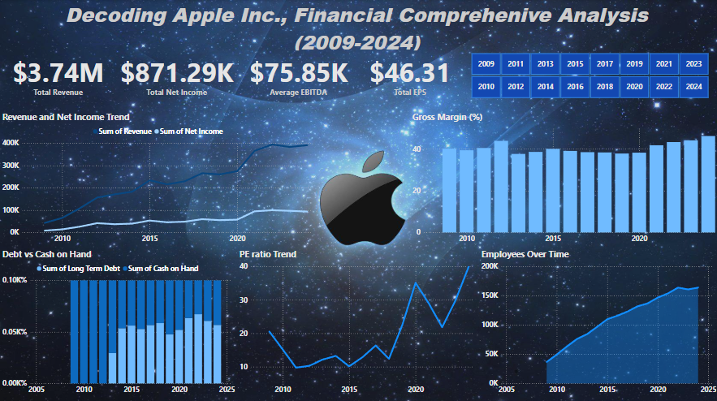
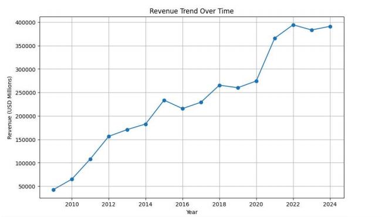
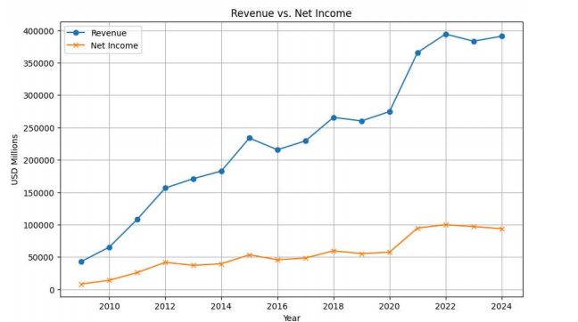
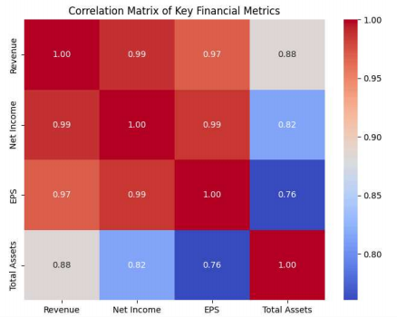
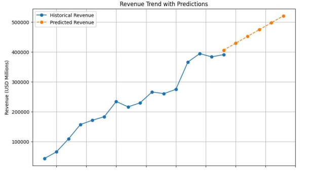

# **Comprehensive Apple Financial Insights: Data Analysis & Visualization with Power BI, Python, and Excel**

This repository contains a comprehensive analysis and visualization of Apple’s financial performance from 2009 to 2024. It demonstrates the use of multiple data analysis and visualization tools, including Power BI, Python, and Excel, to gain insights into Apple’s key financial metrics.

## **Project Overview**
This project leverages Apple’s historical financial data to perform in-depth analysis and create interactive visualizations. It includes various financial indicators such as revenue, EBITDA, net income, gross profit, P/E ratio, and more. By using multiple tools, the project showcases how data can be cleaned, processed, and presented in an insightful manner to aid decision-making and financial forecasting.

## **Tools and Technologies**
- **Power BI**: For interactive data visualizations and dashboards.
- **Python**: Using libraries like Pandas, Matplotlib, and Seaborn for data analysis and visualization.
- **Excel**: For data management, pivot tables, and detailed analysis.
- **PDF**: Documentation and reports generated from the analysis.

## **File Structure**
The repository includes the following files:
- **.ipynb**: Jupyter notebook containing Python code for analysis and visualization.
- **.pbix**: Power BI project file with interactive dashboards.
- **.xlsx**: Excel file with raw data and detailed analysis.
- **.pdf**: A detailed report summarizing the findings and insights derived from the data.

## **How to Use**
### Python Files
1. Clone the repository to your local machine.
2. Open the `.ipynb` file in Jupyter Notebook or Google Colab.
3. Run the cells to see the analysis and visualizations.
4. Make sure you have the necessary Python libraries installed: Pandas, Matplotlib, Seaborn, etc.

### Power BI Files
1. Download and install Power BI Desktop if you haven't already.
2. Open the `.pbix` file in Power BI Desktop.
3. Explore the interactive dashboards and insights created from the dataset.

### Excel Files
1. Open the `.xlsx` file using Microsoft Excel or Google Sheets.
2. Explore the raw data and analysis using pivot tables and charts.

### PDF Report
1. The PDF report provides an overview of the analysis, findings, and visualizations. It can be viewed directly in the repository.

## **Key Insights**
- **Revenue Trends**: Explore how Apple’s revenue has grown over the years, driven by product launches, services, and global expansion.
- **Profitability Analysis**: A breakdown of key profitability metrics like gross profit, operating income, and net income.
- **Stock Performance**: Analyzing the P/E ratio, year-end closing prices, and the overall stock performance of Apple.
- **Financial Ratios**: In-depth insights into Apple’s financial health through various ratios, including Gross Margin, EBITDA margin, and Debt-to-Equity ratio.

## **Project Screenshots**

## **How to Contribute**
Feel free to fork the repository, make changes, and create pull requests. Any suggestions or improvements for the analysis, visualizations, or report are welcome!
